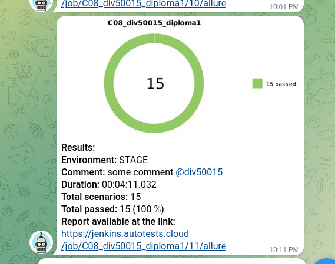

#  Дипломный проект по автоматизации тестирования сайта и мобильного приложения WINK 
> <a target="_blank" href="https://www.wink.ru">ссылка на сайт WINK</a>


----

### Список UI автотестов

- [x] Главная страница отображается
- [x] Страница ТВ-каналы отображается
- [x] Страница Фильмы отображается 
- [x] Страница Моё кино отображается
- [x] Страница Сериалы отображается
- [x] Страница Фильмы с фильтром по 2023 году отображается
- [x] Страница Фильмы с фильтром и сортировкой по рейтингу отображается


### Список API автотестов

- [x] Страница авторизации отображается
- [x] Страница авторизации отображается
- [x] Страница поиска отображается
- [x] Страница Фильмы отображается


### Список MOBILE автотестов

- [x] Загрузка страницы Фильмы
- [x] Загрузка страницы Моё кино
- [x] Загрузка страницы Сериалы
- [x] Загрузка страницы ТВ-каналы

----

### Используемый стэк

        

----

### Локальный запуск автотестов

#### Выполнить в cli:
> [!NOTE]
> Ключ выбора версии `--browser-version` не обязателен

> [!NOTE]
> Ключ выбора мобильного устройства `--context` не обязателен
```bash
python -m venv .venv
source .venv/bin/activate
pip install -r requirements.txt
pytest . --browser-version=100 --context=bstack
```

#### Получение отчёта:
```bash
allure serve build/allure-results
```

----

### Проект в Jenkins
> <a target="_blank" href="https://jenkins.autotests.cloud/job/C08_div50015_diploma1//">Ссылка</a>

#### Параметры сборки


* environment - параметр определяет окружение для запуска тестов
* comment - комментарий


#### Запуск автотестов в Jenkins
1. Открыть <a target="_blank" href="https://jenkins.autotests.cloud/job/lesson15-hw_jenkins_full_project//">проект</a>
2. Нажать "Build with Parameters"
3. Из списка "ENVIRONMENT" выбрать: PROD
4. В поле "COMMENT" ввести комментарий
5. Нажать "Build"

----

### Allure отчет
#### Общие результаты


#### Список тест кейсов


#### Отчет прохождения теста


----

### Интеграция с Allure TestOps
> <a target="_blank" href="https://allure.autotests.cloud/project/3941/launches">Ссылка на проект</a>

#### Дашборд с общими показателями тестовых прогонов


#### История запуска тестовых наборов


#### Тест кейсы


----


### Оповещения в Telegram


----

### Видео прохождения автотестов


----
#### Интеграция с JIRA


----

